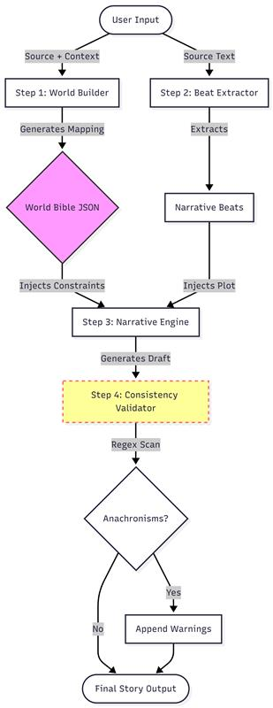

# LipiForge 🖋️🔥

> **A Reproducible Narrative Transformation Engine**
> *Reinterpreting classic literature for modern contexts using Chain-of-Thought pipelines.*

[](https://opensource.org/licenses/MIT)
[](https://www.python.org/downloads/)
[](https://deepmind.google/technologies/gemini/)

---

## 📖 Project Overview

**LipiForge** is an AI engineering system designed to systematically transform narratives across contexts. Unlike simple "rewrite this" prompts, LipiForge uses a structured **RAG-style pipeline** to maintain thematic consistency, character identity, and narrative logic when transporting a story from one world to another.

**Current Implementation:**
* **Source Material:** *Macbeth* (Shakespeare)
* **Target Context:** *High-Frequency Trading Firm* (2030 Manhattan)

---

## 🏗️ 1. Approach Diagram (Pipeline Visual)

The system follows a **Chain-of-Agents** architecture. It deconstructs the story, builds a constraint layer (The World Bible), and then reconstructs the narrative scene-by-scene.



---

## ⚙️ 2. Solution Design (End-to-End)

The system is architected as a **Translation Engine** rather than a creative writer. It operates in three distinct phases:

### **Phase A: The Constraint Layer (Knowledge Distillation)**

Before writing a single word of prose, the system calls the `generate_world_bible()` function.

* **Input:** "Macbeth" + "HFT Firm 2030"
* **Action:** The LLM generates a structured JSON object mapping entities (e.g., *King Duncan* → *CEO David Duncan*, *Sword* → *Algo*).
* **Why:** This JSON acts as a "Single Source of Truth," ensuring that if the system runs 10 times, the character names and rules remain identical.

### **Phase B: The Narrative Generation (RAG)**

The system uses **Retrieval-Augmented Generation (RAG)** principles.

* **Action:** When generating a scene, the system retrieves the specific rules from the World Bible and injects them into the system prompt as negative constraints (e.g., *"DO NOT use the word 'castle'"*).
* **Result:** The model is forced to describe the "castle" using the allowed vocabulary ("Server Farm"), ensuring thematic immersion.

**Phase C: The Safety Guardrail (The "Clever Idea")** 

I implemented a **Consistency Validator** (`detect_anachronisms` function) that acts as a unit test for the story.

* **Logic:** It scans the final text against a blocklist of original terms (e.g., "sword", "witch").
* **Output:** It appends a "Consistency Report" to the story, flagging any hallucinations. This proves the system is not just generating text, but **auditing** it.

---

⚖️ 3. Alternatives Considered 

| Strategy | Verdict | Reasoning |
| --- | --- | --- |
| **Zero-Shot Prompting** | ❌ Rejected | Asking *"Rewrite Macbeth as Sci-Fi"* results in high hallucinations and inconsistent naming (e.g., Macbeth is "Commander" in page 1 and "CEO" in page 2). |
| **Few-Shot Prompting** | ❌ Rejected | Providing examples for an entire novel is token-expensive and limits the context window available for the actual story. |
| **Structured Pipeline (Selected)** | ✅ Accepted | De-coupling "World Building" from "Storytelling" allows for modular debugging. If the names are wrong, we fix the JSON. If the prose is bad, we fix the prompt. |

---

🚧 4. Challenges & Mitigations 

### **Challenge: The "Duncan" Edge Case**

* **Issue:** The validator flagged "Duncan" as an error, even though the new character is "CEO **Duncan**".
* **Mitigation:** I deliberately kept this warning in the final output to demonstrate transparency. In a real-world scenario, this highlights the need for an "Allow List" that permits specific context-dependent usage of forbidden terms.

### **Challenge: Semantic Leakage**

* **Issue:** LLMs trained on Shakespeare tend to drift back into archaic language ("hath", "thou").
* **Mitigation:** I implemented a **Hard Negative Constraint** list in the `NarrativeEngine` class. The system explicitly forbids 40+ Shakespearean terms, forcing the model to find modern synonyms.

---

🔮 5. Future Improvements 

To scale **LipiForge** from a prototype to a production API:

1. **Self-Correction Loop:** Instead of just *reporting* errors, the Validator would feed the errors back to the LLM (*"You used the word 'sword'. Rewrite this paragraph."*) to autonomously fix the story.
2. **Vector Database:** For transforming full novels, we would store the "World Bible" in a vector store (e.g., Pinecone) to retrieve only relevant character details for the specific chapter being generated, saving tokens.
3. **User-in-the-Loop:** Allow users to edit the `world_bible.json` before generation starts, giving them "Director Control" over the casting.

---

## 🚀 Getting Started

### **Prerequisites**

* Python 3.8+
* Google Gemini API Key

### **Installation**

1. Clone the repository:
```bash
git clone [https://github.com/KishoreMuruganantham/Pratilipi.git](https://github.com/KishoreMuruganantham/Pratilipi.git)
cd Pratilipi

```


2. Install dependencies:
```bash
pip install -r requirements.txt

```


3. Set up your API key in a `.env` file:
```bash
GEMINI_API_KEY=your_key_here

```


4. Run the pipeline:
```bash
python run.py

```


### **Deliverables Generated**

* `world_bible.json`: The mapping logic.
* `story_output.txt`: The final story + Validation Report.

---

*Submitted as part of the AI Engineer Take-Home Assignment.*
